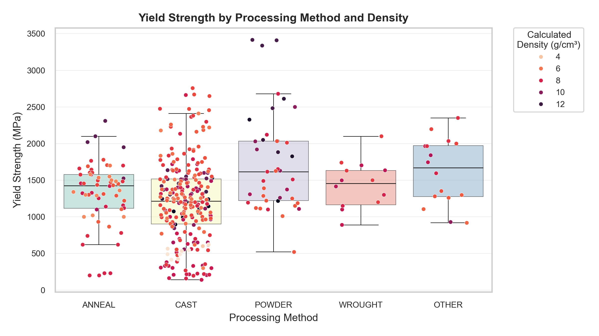
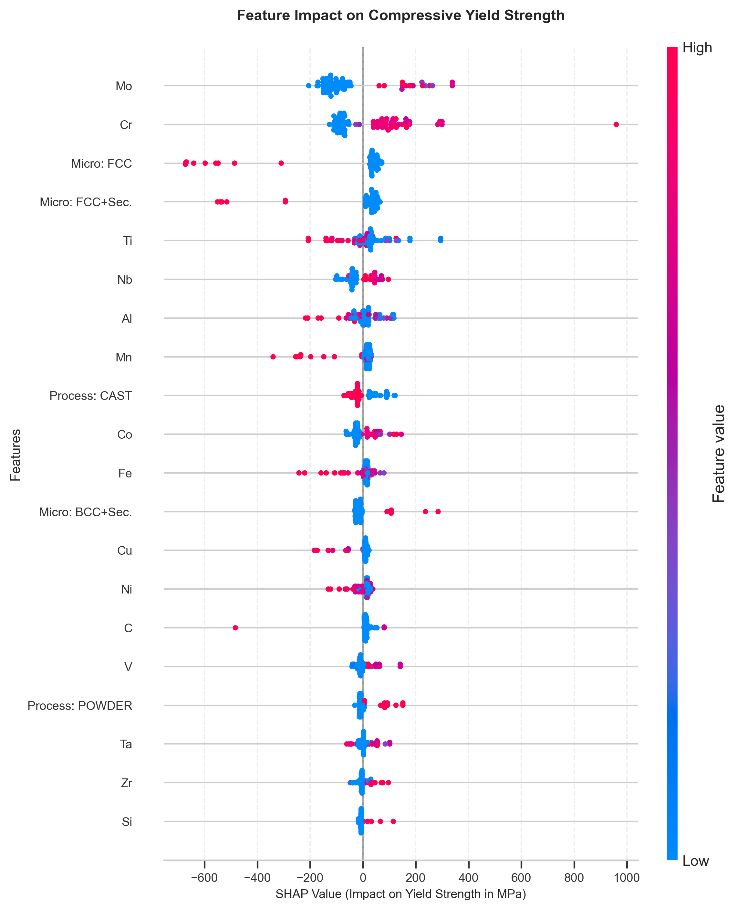

<h1 align="center">Predicting Yield Strength in Multi-Principal Element Alloys</h1>
<br>

[](https://github.com/MathRC/mpea)  
[](https://github.com/MathRC/mpea/blob/main/LICENSE)  
[](analysis/analysis.ipynb)

<p align="center"><em>Using data science and machine learning to explore and predict yield strength in multi-principal element alloys based on composition, microstructure, and processing methods</em></p>
<br>

<p align="center">
  
</p>

---

## 🔍 Overview  
This project explores a curated dataset of **Multi-Principal Element Alloys (MPEAs)** to:  
1. **Identify high-strength alloys** through exploratory data analysis (EDA)  
2. **Predict yield strength** based on composition, microstructure, and processing methods  
3. **Interpret key drivers** of mechanical performance using SHAP analysis  

This analysis focuses on **compressive yield strength** at **room temperature (25 °C)** from a curated subset of the full dataset.

**Key Results:**  
- An **XGBoost model** achieved **R² = 0.82**, outperforming linear (Ridge) and non-parametric (KNN) models  
- SHAP analysis highlighted **Mo, Cr**, and **BCC+secondary phases** as critical contributors to strength

---

## 📂 Repository Structure  
```
|
├── analysis/                # Jupyter notebook + visuals
├── data/
│   ├── raw/                 # Original dataset (MPEA_dataset.csv, compositions.csv)
│   └── processed/           # Cleaned data and top-performing alloys
├── LICENSE.txt              # MIT License terms
├── README.md                # This file
└── environment.yml          # Conda environment configuration
```

---

## 📊 Dataset Description  

The dataset originates from the study *"Expanded dataset of mechanical properties and observed phases of multi-principal element alloys"* (Borg et al., 2020) and includes information such as **yield strength measurements**, **chemical composition**, **microstructure**, **processing methods**, **density**, **grain size**, and more.

It is publicly available via [Citrine Informatics' GitHub repository](https://github.com/CitrineInformatics/MPEA_dataset) and stands as a landmark contribution to open materials science research.

---

## 🛠️ Tech Stack  

- **Python**: Pandas, NumPy, Scikit-learn, XGBoost, SHAP  
- **Visualization**: Matplotlib, Seaborn, Missingno  
- **Workflow**: Jupyter Notebook, Git  

---

## 🎯 Key Insights  

### Top-Performing Alloys  
- **Highest Yield Strength**: `Cr1 Mo1 Nb1 Ta1 V1 W1` (BCC+Laves+Sec., powder-processed) achieved **3416 MPa**.  
- **Best Strength-to-Weight**: `Al1 Co1 Cr1 Fe1 Ni1 Si1` (BCC+Sec., cast) reached **423 MPa·cm³/g**.  
*(See full lists in [`data/processed/`](data/processed/).)*  

<br>

### Model Performance  
| Model       | R²    | RMSE (MPa) |  
|-------------|-------|------------|  
| Ridge       | 0.485 | 454.4      |  
| KNN         | 0.690 | 352.3      |  
| **XGBoost** | 0.821 | 268.3      |  
*R² = 0.821 indicates XGBoost explains 82.1% of variance in yield strength.*  

<br>

### SHAP Analysis  

<p align="center">
  
</p>

*Key drivers of yield strength:*  
- **↑ Strength**: High Mo/Cr, BCC+Sec. microstructure, powder processing.  
- **↓ Strength**: FCC phases, casting.  

---

## 💻 How to Reproduce  

1. **Clone the repository**:

   ```bash
   git clone https://github.com/MathRC/mpea.git
   cd mpea
   ```

<div style="margin-top: 0.8em;"></div>

2. **Set up the Conda environment**:

   ```bash
   conda env create -f environment.yml
   conda activate mpea
   ```

<div style="margin-top: 0.8em;"></div>

3. **Run the analysis**:

   * Open `analysis.ipynb` in Jupyter Notebook/Lab
   * All data paths in the notebook are relative to the repo root

---

## 🤝 Acknowledgments  
- **Citrine Informatics** for hosting this transformative dataset and enabling open science.  
- **Borg et al. (2020)** for curating and validating a dataset of over 1,000 MPEA entries through domain expertise and statistical reviews.  
- **Materials Science Community** for pioneering research that bridges metallurgy and data-driven design.  

---

## 📚 References  

[1] Borg, C. K. H., Frey, C., Moh, J., Pollock, T. M., Gorsse, S., et al. (2020).  
Expanded dataset of mechanical properties and observed phases of multi-principal element alloys. *Scientific Data*, 7, 430.  
https://doi.org/10.1038/s41597-020-00768-9  

[2] Borg, C., & Saal, J. (2020).  
Expanded dataset of mechanical properties and observed phases of multi-principal element alloys. *GitHub repository*.  
Available at: https://github.com/CitrineInformatics/MPEA_dataset

---

## 📝 License  
This project is licensed under the [MIT License](https://github.com/MathRC/mpea/blob/main/LICENSE).

---

**🔗 Connect:** [LinkedIn](https://www.linkedin.com/in/mrctranslations/) • [GitHub](https://github.com/MathRC)  
**📧 Email:** [matt25data@gmail.com](mailto:matt25data@gmail.com)


*✨ Open to collaboration and feedback!*  

---

